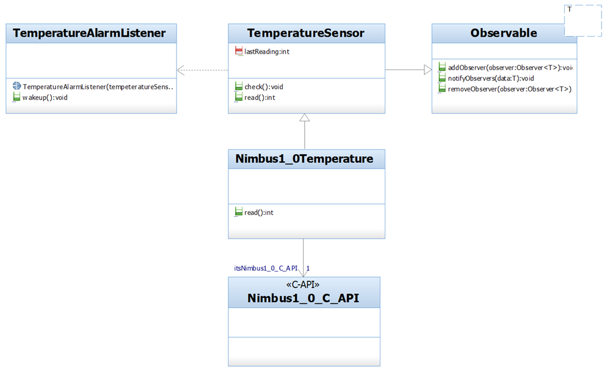
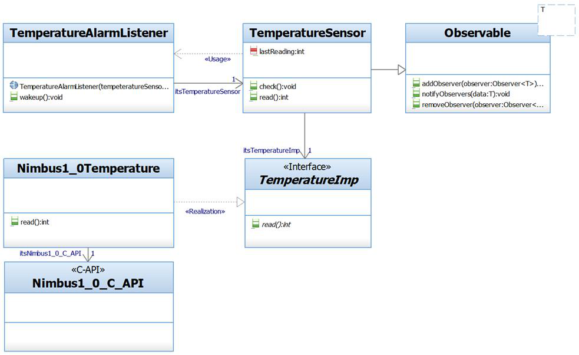

## Question
שאלה זו מתייחסת לתרשימים 13.3.2, המופיעים בתחילת הבחינה. תרשים 3.2 מבטא את שינוי עיצובי שערכנו בתרשים 3.2: כידוע, בפרויקט מערכת ניטור מזג האוויר מעורבים מהנדסי תוכנה וגם מהנדסי חומרה. בפרט מהנדסי החומרה אמורים לפתח את המחלקות `Nimbus1_0TemperatureSensor` ו-`Nimbus1_0_C_API`. כמה מחלקות/ממשקים (פרט לאלה שהם מפתחים בעצמם) אמורים מהנדסי החומרה להכיר על מנת שהקוד שלהם יתקמפל לפני ואחרי השינוי.

### Options
- לפני השינוי צריך להכיר 5 מחלקות/ממשקים, ואחרי השינוי צריך להכיר 1
- לפני ואחרי השינוי צריך להכיר 3 מחלקות/ממשקים
- לפני השינוי צריך להכיר 5 מחלקות/ממשקים, ואחרי השינוי צריך להכיר 1
- לפני השינוי צריך להכיר 5 מחלקות/ממשקים, ואחרי השינוי צריך להכיר 2

## Answer
האפשרות הנכונה היא "לפני השינוי צריך להכיר 5 מחלקות/ממשקים, ואחרי השינוי צריך להכיר 1".

**לפני השינוי (תרשים 3.1):**
מהנדסי החומרה מפתחים את `Nimbus1_0Temperature` ואת `Nimbus1_0_C_API`. במצב זה, `Nimbus1_0Temperature` (המימוש החומרתי) ככל הנראה מקושר ישירות ל-`TemperatureSensor` (ההפשטה התוכנתית). בנוסף, `TemperatureSensor` מקושר ל-`Observable`, ו-`TemperatureAlarmListener` מקושר ל-`TemperatureSensor`. לכן, כדי שהקוד של מהנדסי החומרה יתקמפל וישתלב במערכת, הם צריכים להכיר את כלל המרכיבים המעורבים בתהליך קריאת הטמפרטורה: `TemperatureAlarmListener`, `TemperatureSensor`, `Observable`, `Nimbus1_0Temperature`, ו-`Nimbus1_0_C_API`. אם נתעלם מאלה שהם מפתחים בעצמם (`Nimbus1_0Temperature` ו-`Nimbus1_0_C_API`), הם עדיין צריכים להכיר את `TemperatureAlarmListener`, `TemperatureSensor`, ו-`Observable` (3). עם זאת, אם נפרש את השאלה ככמה *סה"כ* מחלקות/ממשקים רלוונטיים הם צריכים להיות מודעים אליהם במערכת הכוללת, המספר הוא 5.

**אחרי השינוי (תרשים 3.2):**
השינוי מציג את תבנית ה-Bridge על ידי הוספת הממשק `TemperatureImp`. כעת, `TemperatureSensor` (ההפשטה) תלויה ב-`TemperatureImp` (ההפשטה של המימוש), ו-`Nimbus1_0Temperature` (המימוש החומרתי) מממשת את `TemperatureImp`. כתוצאה מכך, מהנדסי החומרה, בעת פיתוח `Nimbus1_0Temperature`, צריכים להכיר רק את הממשק `TemperatureImp` (כדי לממש אותו). `Nimbus1_0_C_API` עדיין מפותח על ידם. לכן, התלות החיצונית היחידה עבור `Nimbus1_0Temperature` היא ב-`TemperatureImp` (1).
