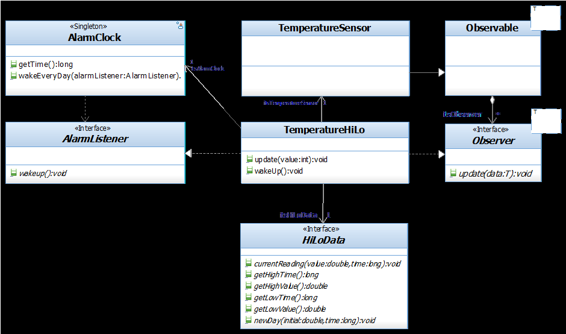
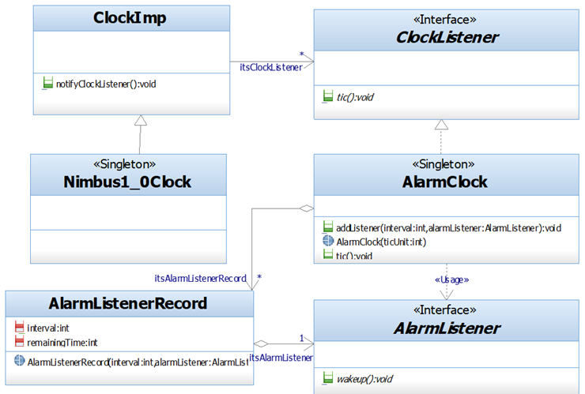

## Question
שאלה זו מתייחסת לתרשימים 12 המופיעים בתחילת הבחינה.
בהתייחס לתרשימים הנתונים בלבד, מיהם הגורמים האחראים להפעלת המתודה `currentReading` (מופיע בתרשים א, במחלקה `HiLoData`), מהגורם העקיף ביותר ועד הגורם הישיר ביותר?
תזכורת : המתודה `currentReading` בודקת האם ערך טמפרטורה נתון, גבוה מערך הטמפרטורה המקסימלי (או נמוך מהמינימלי) הידוע עד כה ביממה הנוכחית, ומעדכנת ערכים בהתאם.

### Options
- Nimbus1_0Clock, AlarmClock, TemperaturSensor, TemperatureHiLo
- Nimbus1_0Clock, AlarmClock, TemperatureHiLo, TemperaturSensor
- TemperaturSensor, TemperatureHiLo, Nimbus1_0Clock, AlarmClock
- TemperaturSensor, Nimbus1_0Clock, AlarmClock, TemperatureHiLo

## Answer
האפשרות הנכונה היא "Nimbus1_0Clock, AlarmClock, TemperaturSensor, TemperatureHiLo". ננתח את שרשרת האחריות מהגורם העקיף ביותר ועד הישיר ביותר להפעלת `currentReading`:
1.  **`Nimbus1_0Clock`:** זהו השעון הראשי (Singleton) שמפעיל את מחזור ה'טיק' (tic) באופן קבוע.
2.  **`AlarmClock`:** ה-`Nimbus1_0Clock` מפעיל את ה-`AlarmClock` (דרך `tic()` או `wakeEveryDay`). ה-`AlarmClock` אחראי לנהל את ה-`AlarmListener`ים הרשומים אליו.
3.  **`TemperatureSensor`:** ה-`TemperatureSensor` הוא ככל הנראה `AlarmListener` (או `Observer`) שנרשם ל-`AlarmClock`. כאשר ה-`AlarmClock` מפעיל את ה-`AlarmListener`ים שלו, ה-`TemperatureSensor` מקבל עדכון.
4.  **`TemperatureHiLo`:** ה-`TemperatureSensor` משתמש ב-`TemperatureHiLo` (דרך שדה `itsHiLoData` או קשר אחר) כדי לעבד את נתוני הטמפרטורה. ה-`TemperatureHiLo` הוא זה שבסופו של דבר קורא למתודה `currentReading` על אובייקט `HiLoData` כדי לעדכן את נתוני השיא והשפל.
