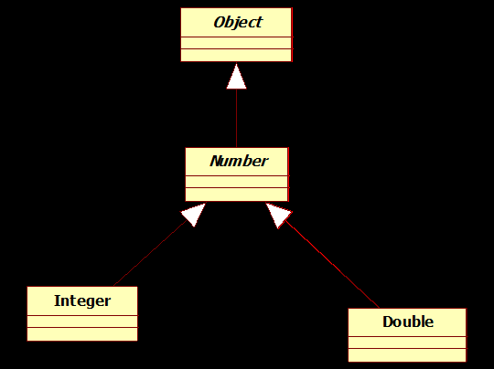

## Question
נתון הקוד של הפונקציה `copy` המעתיקה את האלמנטים הנמצאים ברשימה `src` לתוך הרשימה `dest`.
```java
public class Collections {
    public static <T> void copy
    (List<? super T> dest, List<? extends T> src) {
        for (int i=0; i<src.size(); i++)
            dest.set(i,src.get(i));
    }
}
```
נתונה גם היררכיית מחלקות מובנות ב Java : 
נתונות ההפניות הבאות לרשימות שונות :
`List<Object> objects = new ArrayList<Object>();`
`List<Integer> integers = new ArrayList<Integer>();`
`List<Double> doubles = new ArrayList<Double>();`
הניחו שבכל ההפניות שבשמן מופיעה המילה `input` הכניסו כבר לרשימה אובייקטים מסוגים שחוקי להכניסם באותה רשימה.
נתונות שלוש הקריאות השונות הבאות לפונקציה `copy` :
`MyCollection.<Object>copy(objects, integers);`
`MyCollection.<Double>copy(doubles, doubles);`
`MyCollection.<Integer>copy(objects, integers);`
כמה מתוך שלוש הקריאות הנייל לפונקציה `copy`, הן חוקיות (דהיינו, יעברו קומפילציה בהצלחה)?

### Options
- 3
- 2
- 1
- 0

## Answer
האפשרות הנכונה היא "3". ננתח כל קריאה לפונקציה `copy(List<? super T> dest, List<? extends T> src)`:

1.  **`MyCollection.<Object>copy(objects, integers);`**
    *   `T` מוגדר כ-`Object`.
    *   `dest`: `objects` הוא `List<Object>`. `Object` הוא סופר-טיפוס של `Object` (או `Object` עצמו). `List<? super Object>` מתאים ל-`List<Object>`. **תקין.**
    *   `src`: `integers` הוא `List<Integer>`. `Integer` מרחיב את `Object`. `List<? extends Object>` מתאים ל-`List<Integer>`. **תקין.**
    *   **קריאה זו חוקית.**

2.  **`MyCollection.<Double>copy(doubles, doubles);`**
    *   `T` מוגדר כ-`Double`.
    *   `dest`: `doubles` הוא `List<Double>`. `Double` הוא סופר-טיפוס של `Double` (או `Double` עצמו). `List<? super Double>` מתאים ל-`List<Double>`. **תקין.**
    *   `src`: `doubles` הוא `List<Double>`. `Double` מרחיב את `Double`. `List<? extends Double>` מתאים ל-`List<Double>`. **תקין.**
    *   **קריאה זו חוקית.**

3.  **`MyCollection.<Integer>copy(objects, integers);`**
    *   `T` מוגדר כ-`Integer`.
    *   `dest`: `objects` הוא `List<Object>`. `Object` הוא סופר-טיפוס של `Integer`. `List<? super Integer>` מתאים ל-`List<Object>`. **תקין.**
    *   `src`: `integers` הוא `List<Integer>`. `Integer` מרחיב את `Integer`. `List<? extends Integer>` מתאים ל-`List<Integer>`. **תקין.**
    *   **קריאה זו חוקית.**

כל שלוש הקריאות חוקיות ויעברו קומפילציה בהצלחה.
