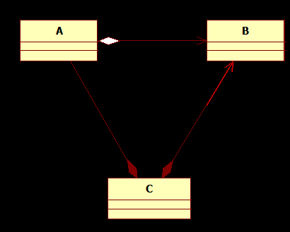

## Question
נתון התרשים הבא: 
הניחו ששמות השדות הם `itsA`, `itsB`, `itsC` בהתאם לטיפוס השדה.
איזה קוד ניתן להסיק מהתרשים שמתאים להיות כחלק מקוד הבנאי מחלקת C

### Options
- itsA.setItsC(this)
- itsA.setItsB(itsB)
- itsB.setItsC(this)
- itsB.setItsA(itsA)

## Answer
האפשרות הנכונה היא `itsA.setItsC(this)`. מהתרשים עולה כי למחלקה `C` יש שדה `itsA` מטיפוס `A`, ולמחלקה `A` יש שדה `itsC` מטיפוס `C`. לכן, בתוך הבנאי של `C`, ניתן לגשת לשדה `itsA` (שהוא אובייקט מסוג `A`) ולשנות את השדה `itsC` שלו לאובייקט הנוכחי של `C` (באמצעות `this`).
