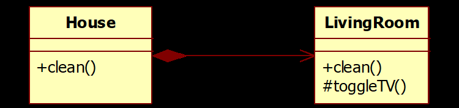

## Question
נתון שרטוט המתאר בית וחדר מגורים. הניחו כי במהלך ניקוי חדר המגורים יש לכבות את הטלוויזיה

סמנו מהו המשפט הנכון

### Options
- במודל קיימת בעיית DIP
- במודל קיימת בעיית LSP
- במודל קיימת בעיית ISP
- המודל תקין

## Answer
האפשרות הנכונה היא "במודל קיימת בעיית DIP". עקרון היפוך התלויות (DIP) קובע שמודולים ברמה גבוהה לא צריכים להיות תלויים במודולים ברמה נמוכה. שניהם צריכים להיות תלויים בהפשטות. במקרה זה, המחלקה `House` (מודול ברמה גבוהה) תלויה ישירות במחלקה `LivingRoom` (מודול ברמה נמוכה) ובשיטת `toggleTV()` שלה. אם `House` צריכה לכבות את הטלוויזיה, היא צריכה לעשות זאת דרך הפשטה (למשל, ממשק `SwitchableDevice`) ולא דרך תלות ישירה במימוש ספציפי של חדר.
