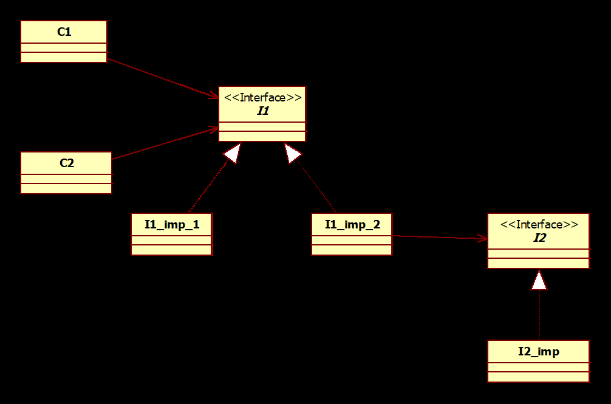

## Question
נתון תרשים המחלקות הבא: 
עליך להשתמש ב Dependency Injection על מנת לאתחל את המערכת עם אובייקט מסוג `C1` ואובייקט מסוג `C2`. האובייקט מסוג `C1` יצביע (יפנה) לאובייקט מסוג `I1_imp_1` והאובייקט מסוג `C2` יצביע (יפנה) לאובייקט מסוג `I1_imp_2`.
האובייקט מסוג `I1_imp_2` יצביע לאובייקט מסוג `I2_imp`.

הנחיות נוספות:
*   על המערכת להיות גמישה לשינויים עתידיים בצרכי האתחול. בפרט, ייתכן שבעתיד נרצה שהאובייקט מסוג `C1` יצביע (יפנה) דווקא לאובייקט מסוג `I1_imp_2` ואילו האובייקט מסוג `C2` יצביע (יפנה) לאובייקט מסוג `I1_imp_1`.
*   נדרש לאתחל את המערכת באופן כזה ששינוי עתידי כנייל לא יצריך קמפול מחדש של שום מחלקה שמממשת ממשק וגם לא יצריך שום שינוי בפונקציית ה `main` שנמצאת במחלקה `MainApp`.
*   אסור להניח שימוש בקובץ קונפיגורציה.
*   יש להוסיף לקוד הנתון להלן את הקוד הנדרש לאתחול המערכת ע"פ ההנחיות.
*   ניתן להשתמש בשורות הרווח בין הישויות ו/או בתוך היישויות כדי להוסיף את התוספות המתבקשות. אין צורך, כמובן, להשתמש בכל שורות הרווח!
*   ניתן גם להשתמש במקום הפנוי בדף לאחר סוף הקוד הנתון להלן.
*   בנוגע לקוד הנתון, שימו לב: בחלק מהיישויות (מחלקות/ממשקים) אין להוסיף דבר, בחלק יש להוסיף, וניתן גם להוסיף יישויות חדשות לגמרי.
*   הבהרה: הסימון `...` המופיע ביישויות הנתונות להלן, נועד רק לבטא שיש ביישות קוד נוסף שאינו נוגע לעצם השאלה.
*   אם הוספת יישות חדשה, עליך לכתוב אותה במלואה.

## Answer
פתרון:
```java
public interface I1{...}
public interface I2{ ... }

public class C1{
    @Inject @Named("High")
    private I1 i1;
    ...
}

public class C2{
    @Inject @Named("Low")
    private I1 i1;
    ...
}

public class I1_imp_1 implements I1{ ... }

public class I1_imp_2 implements I1 {
    @Inject
    private I2 i2;
    ...
}

public class I2_imp implements I2{ ... }

public class MainApp{
    public static WeldContainer container = new Weld().initialize();
    public static void main(String[] args) {
        C1 c1 = container.select(C1.class).get();
        C2 c2 = container.select(C2.class).get();
        ...
    }
}

@Produces
public @Named("High") I1 getHighI1(){
    return container.select(I1_imp_1.class).get();
}

@Produces
public @Named("Low") I1 getLowI1(){
    return container.select(I1_imp_2.class).get();
}
```

פתרון אלטרנטיבי ללא Producers:
```java
public class C1{
    @Inject @Named("High")
    private I1 i1;
    ...
}

public class C2{
    @Inject @Named("Low")
    private I1 i1;
    ...
}

@Named("High")
public class I1_imp_1 implements I1{ ... }

@Named("Low")
public class I1_imp_2 implements I1 {
    @Inject
    private I2 i2;
    ...
}
```
