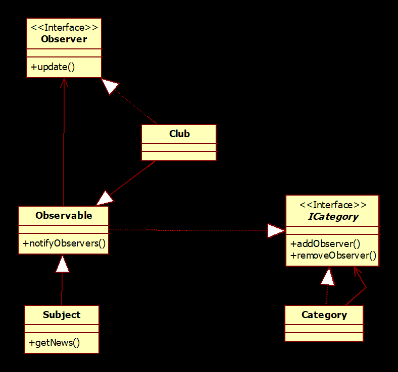
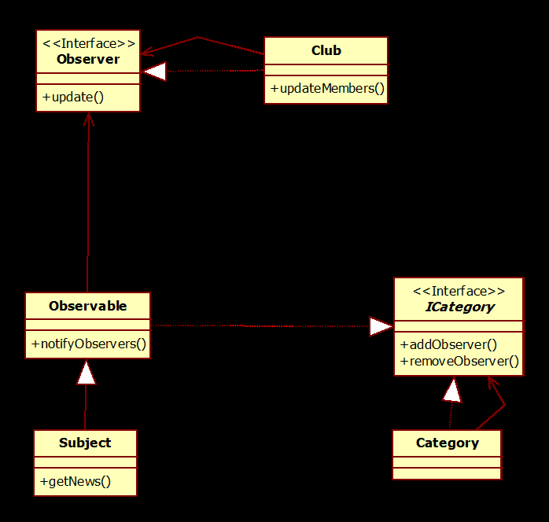

## Question
פורטל החדשות 'תבנית השבועיי' מציע תכנים במגוון רחב של נושאים (Subject). המשתמשים (User) יכולים להרשם לקבלת עדכונים בנושאים שונים. בכל פעם שיש כתבה חדשה בנושא מסויים, כל המשתמשים שנרשמו אליו יקבלו עדכון. כל משתמש מבצע פעולה שונה לאחר קבלת עדכון. ניתן להניח כי קיים כבר מימוש לנושא `Subject1` ולמשתמש `User1` ואין צורך לממש אותם.

**סעיף א (10 נקודות)**
על מנת להקל על המשתמשים לבחור נושאים, הוקמו מועדוני חברים (Club). משתמש יכול להצטרף כחבר למועדון ואף ייתכן שמועדון אחד יצטרף כחבר למועדון אחר. מועדון יכול להרשם לתכנים עבור החברים שהצטרפו אליו. בכל פעם שהמועדון מקבל עדכון הוא מעדכן את החברים שהצטרפו אליו.
השתמש בתבניות עיצוב שנלמדו בכיתה על מנת לממש את המערכת המתוארת על פי הדרישות. צייר תרשים מחלקות המבוסס על תבניות עיצוב שלמדת שתומך בדרישות. כתוב את שם תבניות העיצוב שהשתמשת בהן. כתוב את הקוד עבור המחלקות שציירת.

**סעיף ב (10 נקודות)**
על מנת לפשט את תהליך הרישום, הפורטל הגדיר קטגוריות רישום (Category). קטגוריה יכולה להכיל מספר נושאים ואף ייתכן שקטגוריה אחת תכיל קטגוריה אחרת. רישום משתמש לקטגוריה תוביל להוספתו לקבלת עדכונים בכל הנושאים ששייכים אליה באופן ישיר או עקיף. דרישה: קטגוריה לא תומכת בפעולת עדכון המשתמשים והיא אחראית רק לרישום משתמשים.
השתמש בתבניות עיצוב שנלמדו בכיתה על מנת לממש את המערכת המתוארת על פי הדרישות. צייר תרשים מחלקות המבוסס על תבניות עיצוב שלמדת שתומך בדרישות. כתוב את שם תבניות העיצוב שהשתמשת בהן. כתוב את הקוד עבור המחלקות שציירת.



## Answer
פתרון לשני הסעיפים:
השתמשנו בתבניות עיצוב Composite ו Observer. `Club` הוא גם `Observer` וגם `Observable`. `Category` הוא למעשה Composite של `Observable` (למעשה הוא Composite של הפשטה של `Observable`, מכיוון שהוא צריך לתמוך רק ברישום ולא בעדכון).

```java
public interface ICategory <T> {
    void addObserver(Observer<T> observer);
}

public class Observable <T> implements ICategory<T>{
    private ArrayList<Observer<T>> itsObservers = new ArrayList<>();

    public void addObserver(Observer<T> observer){
        itsObservers.add(observer);
    }

    public void notifyObservers(T val) {
        for (Observer<T> observer: itsObservers) {
            observer.update(val);
        }
    }
}

public interface Observer <T> {
    void update(T val);
}

// אנו מניחים שהעדכונים הם מסוג String
public class Category implements ICategory<String>{
    private ArrayList<ICategory <String>> itsSubCats = new ArrayList<>();

    public void addICategory(ICategory <String> subCat){
        itsSubCats.add(subCat);
    }

    public void addObserver(Observer<String> observer){
        for (ICategory <String> subCat: itsSubCats) {
            subCat.addObserver(observer);
        }
    }
}

public class Club extends Observable<String> implements Observer<String>{
    public void update(String str){
        notifyObservers(str);
    }
}
```

אפשרות נוספת (המועדון הוא Observer Composite):

