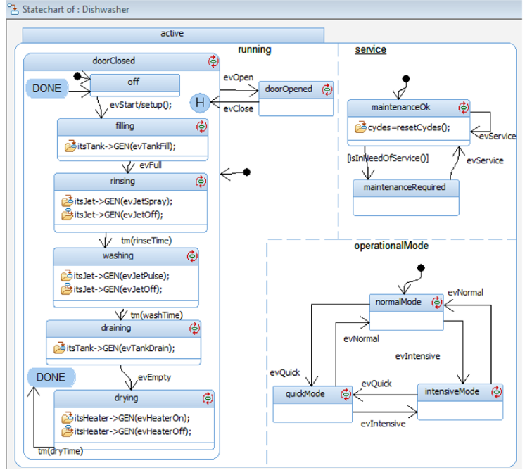
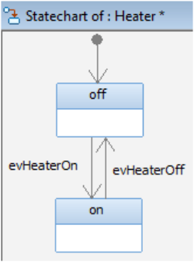
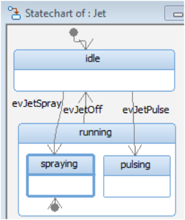

## Question
שאלה זו מתייחסת לתרשימים 1.1-1.4 המופיעים בתחילת הבחינה.
מה נכון לגבי פעולת המדיח לפי התרשימים?

### Options
- כאשר מתקבל אירוע של פתיחת דלת `evOpen` בבקר, תת המערכת `Tank` לא מפסיקה את פעולתה ואילו תתי המערכות `Jet Heater` מפסיקות את פעולתן
- כאשר מתקבל אירוע של פתיחת דלת `evOpen` בבקר, תתי המערכות `Jet, Heater, Tank` מפסיקות את פעולתן
- כאשר מתקבל אירוע של פתיחת דלת `evOpen` בבקר, תתי המערכות `Jet, Heater, Tank` אינן מפסיקות את פעולתן
- כאשר מתקבל אירוע של פתיחת דלת `evOpen` בבקר, תת המערכת `Tank` מפסיקה את פעולתה ואילו תתי המערכות `JetHeater` אינן מפסיקות את פעולתן

## Answer
Looking at the Statechart of Dishwasher (תרשים 1.1), an `evOpen` event transitions from `active` to `doorClosed` state. This implies that all sub-states within `active` (like `running` and `service`) are exited. The `running` state contains `filling`, `rinsing`, `washing`, `draining`, and `drying`, which involve `Tank`, `Jet`, and `Heater`. Exiting `running` means these operations stop. The `Tank` statechart (תרשים 1.2) shows `evEmpty` and `evTankDrain` events, but no direct `evOpen` transition. However, the `Dishwasher` statechart is the higher level. When `active` is exited, all its sub-components' activities cease. Therefore, all sub-systems (`Jet`, `Heater`, `Tank`) stop their operations.
