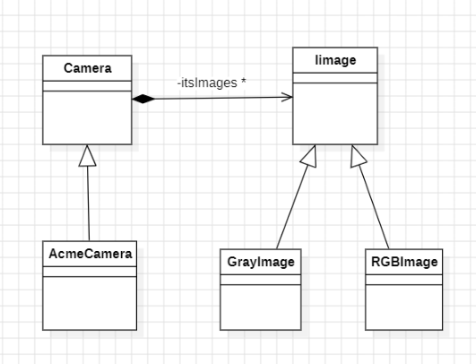

## Question
נניח את העיצוב הבא:

נרצה לאתחל מופע ממחלקת `AcmeCamera` באמצעות מנגנון `dependency injection`. בחרו בתשובה הנכונה

### Options
- .Images ובאנוטציה מותאמת אישית `Inject` באנוטציה `itsImages` נסמן את השדה `Camera` במחלקת נייצר `producer` שערך ההחזרה שלו `<List<Image` המסומן באנוטציה `Images`.
- במחלקת `Camera` נסמן את השדה `itsImages` באנוטציה `Inject`, נסמן את מחלקת `GrayImage` כ-`Default` ו-`RGB` כ-`Alternative`
- במחלקת `Camera` נסמן את השדה `itsImages` באנוטציה `Inject` נסמן את מחלקת `GrayImage` כ-`Alternative` ו-`RGBImage` כ-`Alternative` נייצר `producer` שערך ההחזרה שלו `Image` ובמימוש הפנימי שלו נחזיר `RGBImage` או `GrayImage`, לבחירתינו.
- במחלקת `Camera` נסמן את השדה `itsImages` באנוטציה `Inject`, נסמן את מחלקת `GrayImage` כ-`Alternative`, ו-`RGBImage` כ-`Alternative` נייצר `producer` אחד שערך ההחזרה שלו `<List<Image` שלתוכו נכניס מופע של `GrayImage` ו `producer` נוסף שערך ההחזרה שלו `<List<Image` שלתוכו נכניס מופע של `RGBImage`.

## Answer
To inject a list of `Image` objects into `AcmeCamera`'s `itsImages` field using Dependency Injection, we need to: 1. Mark the `itsImages` field in `Camera` with `@Inject`. 2. Create a producer method that returns `List<Image>`. This producer method should be annotated with `@Produces` and potentially a custom qualifier (like `@Images` as suggested) if there are multiple `List<Image>` producers. The producer would then create and return a list containing instances of `GrayImage` and `RGBImage`. The first option correctly identifies the need for `@Inject` on `itsImages` and a producer for `List<Image>` with a custom qualifier.
