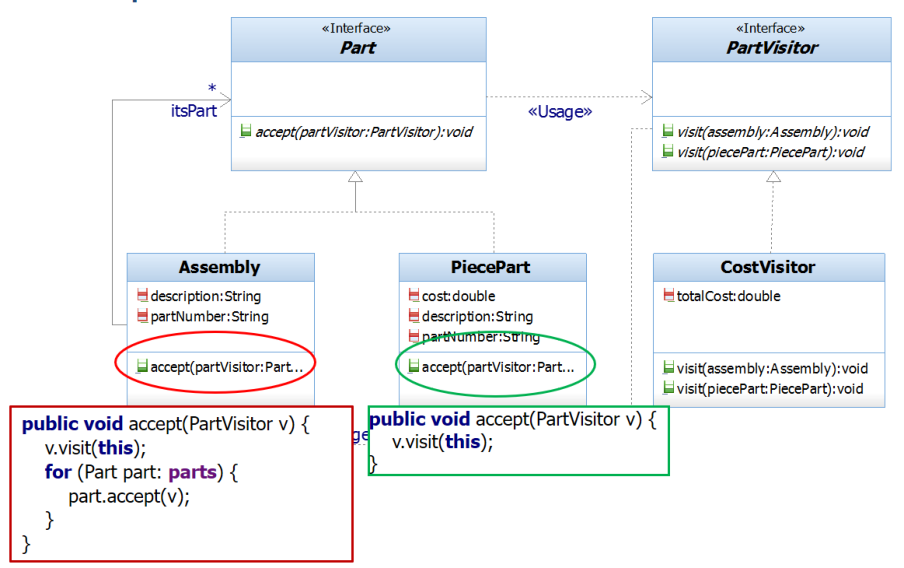

## Question
שאלה זו מתייחסת לתרשים 2 המופיע בתחילת הבחינה. ברצוננו להוסיף מבקר נוסף בשם `PrintPostOrder` אשר יוסיף את היכולת של הדפסת כל העץ בסדר `Post Order`. לשם כך ניצור מחלקה היורשת מ `PartVisitor` מה מבין האפשרויות הבאות הכי נכון?


### Options
- : כדלהלן `PrintPostOrder` במחלקת `visit` נממש את מתודות ```java public void visit(Assembly a){ System.out.println("Assembly : " + a.description); } public void visit(PiecePart p){ System.out.println("PiecePart: " + p.description); } ``` כמו כן נצטרך לשנות את מימוש פונקציית `accept` של `assembly` כדלהלן : ```java public void accept(PartVisitor v){ for(Part p: parts) p.accept(v); v.visit(this); } ```
- : כדלהלן `PrintPostOrder` במחלקת `visit` נממש את מתודות ```java public void visit(Assembly a){ for(Part p: a.getItsParts()) visit(p); System.out.println("Assembly : " + a.description); } public void visit(PiecePart p){ System.out.println("PiecePart: " + p.description); } ``` לא צריך לשנות את מימוש פונקציית `assembly accept`
- :כדלהלן `PrintPostOrder` במחלקת `visit` נממש את מתודות ```java public void visit(Assembly a){ System.out.println("Assembly : " + a.description); } public void visit(PiecePart p){ System.out.println("PiecePart: " + p.description); } ``` לא צריך לשנות את מימוש פונקציית `assembly accept`
- : כדלהלן `PrintPostOrder` במחלקת `visit` נממש את מתודות ```java public void visit(Assembly a){ for(Part p: a.getItsParts()) p.visit(p); System.out.println("Assembly : " + a.description); } public void visit(PiecePart p){ System.out.println("PiecePart: " + p.description); } ```

## Answer
For a Post-Order traversal using the Visitor pattern, the `accept` method in the composite (`Assembly`) should first call `accept` on its children, and *then* call `visit` on itself. The `PiecePart`'s `accept` method simply calls `visit` on itself. The `visit` methods in `PrintPostOrder` will then perform the printing. The first option correctly shows the `Assembly`'s `accept` method calling `accept` on children first, then `v.visit(this)`, which is the definition of post-order traversal for a composite structure. The `visit` methods for `Assembly` and `PiecePart` would then just print their respective descriptions.
