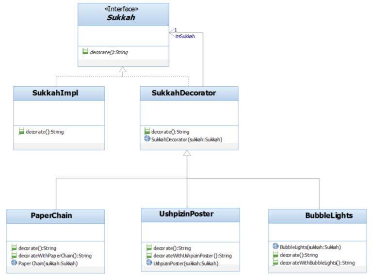

## Question
הדיאגרמה הבאה מתארת מערכת לבנית סוכה, כאשר יש את המחלקה הבסיסית לבנית סוכה `SukkaImpl` , וישנן תוספות לסוכה הבסיסית שהן : `PaperChain`, `UshpizinPoster`, `BubbleLights`.

?`SukkahDecorator` אשר נמצאת במחלקה `decorate(); String` מה יהיה המימוש של המתודה

### Options
- `itsSukkah.decorate()`
- `super.decorate()`
- אין לה מימוש, היא אבסטרקטית
- הפונקציה מפעילה בכל פעם פונקציה `decorate` של אחד הבנים שלה

## Answer
In the Decorator pattern, the `SukkahDecorator` class holds a reference to the `Sukkah` it decorates (its `itsSukkah` field). The `decorate()` method of the decorator should delegate the call to the `decorate()` method of its wrapped component. Therefore, the implementation should be `itsSukkah.decorate()`. This allows the decorator to add its own behavior before or after calling the wrapped component's method, or simply pass through the call.
