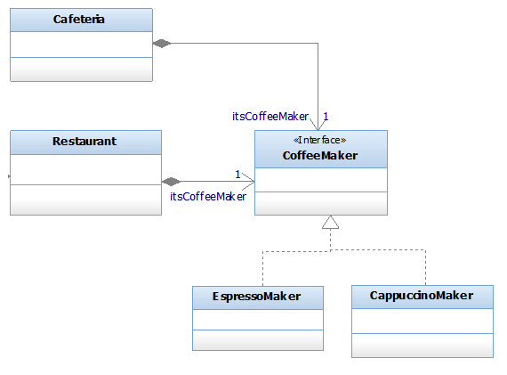

## Question
להלן תרשים מחלקות מתוך מקרה בוחן תחנת מזג האוויר.  הניחו שגם ב `Cafeteria` וגם ב `Restaurant` השדה `itsCoffeeMaker` מסומן באנוטציה `Inject@` בלבד. מה יקרה אם נריץ את הקוד הבא? שימו לב שאין קוד נוסף הקשור לאתחול המערכת. ```java public static void main(String[] args) { WeldContainer container = new Weld().initialize(); Restaurant restaurant = container.select(Restaurant.class).get(); Cafeteria cafeteria = container.select(Cafeteria.class).get(); } ```

### Options
- שאר התשובות לא נכונות.
- אם נגדיר את האנוטציה `Alternative@` מעל מחלקת `EspressoMaker`, ולא נגדיר אותה מעל `CappucinoMaker` (אך ייתכן שיש מעליה אנוטציות אחרות), בהכרח ייווצר מופע אחד של `CoffeeMaker`.
- אם נגדיר את האנוטציה `Alternative@` מעל מחלקת `EspressoMaker`, ולא נגדיר אותה מעל `CappucinoMaker` (אך ייתכן שיש מעליה אנוטציות אחרות), בהכרח ייווצרו שני מופעים שונים של אותה תת מחלקה של `CoffeeMaker`.
- מכיוון ששתי מחלקות מממשות את הממשק `CoffeMaker` אם לא נגדיר אחת מהן כ `Alternative`, התוכנית לא תעבור קומפילציה.

## Answer
בסביבת CDI (כמו Weld), כאשר ישנם מספר מימושים (Implementations) של ממשק (כמו `EspressoMaker` ו-`CappuccinoMaker` עבור `CoffeeMaker`), והם אינם מסומנים באנוטציית `@Alternative` או `@Default` (או קביעת עדיפות אחרת), ה-Container לא יודע איזה מימוש להזריק. במצב כזה, ה-Container יזרוק שגיאת `AmbiguousResolutionException` בזמן ריצה, מכיוון שיש יותר ממועמד אחד להזרקה. לכן, התוכנית לא תעבור קומפילציה (במובן של כישלון בזמן הריצה של ה-Container), אלא תיכשל בזמן ריצה. האפשרות הרביעית קרובה, אך היא מדברת על קומפילציה, בעוד שהשגיאה היא בזמן ריצה. האפשרות השנייה מתארת את הפתרון הנכון לבעיה זו, שכן שימוש ב-`@Alternative` על מימוש אחד יגרום ל-Weld לבחור בו כברירת מחדל כאשר אין בחירה ספציפית אחרת, ובכך ייווצר מופע אחד של `CoffeeMaker`.
