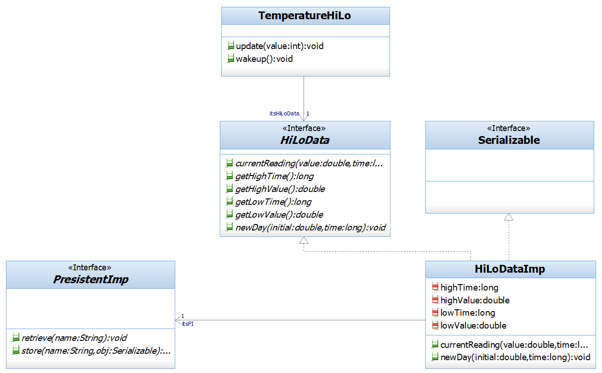

## Question
בתרשים זה הוצגה בעית `OCP` : האלגוריתם לחישוב ערכי מינימום/מקסימום תלוי בשיטת שמירת הנתונים לטווח ארוך. כדי לפתור בעיה זו החלטנו לשלב את תבנית העיצוב "Proxy"י בעיצוב, ובאמצעותה להפריד בין האלגוריתם לבין שיטת שמירת הנתונים. אולם, כידוע המטרה הקלאסית של תבנית העיצוב "Proxy"י היא למנוע גישה ישירה (או לאפשר גישה מבוקרת בלבד) למשאב. מהו המשאב שהוספת התבנית מונעת גישה ישירה אליו? מיהי המחלקה שהוספת התבנית מפרידה בינה לבין המשאב? 

### Options
- .`TemperatureHiLo` המשאב הוא האלגוריתם, המחלקה היא
- .`HiLoData` המשאב הוא האלגוריתם, המחלקה היא
- .`TemperatureHiLo` המחלקה היא ,`PersistentImp` המשאב הוא
- .`PersistentImp` המשאב הוא האלגוריתם, המחלקה היא

## Answer
תבנית ה-Proxy משמשת כמעטפת (Wrapper) לאובייקט אחר (ה-Real Subject) כדי לספק גישה מבוקרת אליו. במקרה זה, הבעיה היא שהאלגוריתם לחישוב מינימום/מקסימום תלוי בשיטת שמירת הנתונים לטווח ארוך. ה-Proxy נועד להפריד בין האלגוריתם לבין שיטת שמירת הנתונים. מכאן שהמשאב שאליו ה-Proxy מונע גישה ישירה (או מתווך גישה) הוא מנגנון שמירת הנתונים לטווח ארוך. המחלקה `PersistentImp` היא זו שאחראית על שמירת הנתונים (Persistent Implementation). לכן, `PersistentImp` הוא המשאב, והמחלקה שמוסיפים כדי להפריד בינה לבין המשאב היא ה-Proxy עצמו, אשר יתווך את הגישה ל-`PersistentImp`. האפשרות השלישית, "המשאב הוא `PersistentImp`, המחלקה היא `TemperatureHiLo`", היא הנכונה. `TemperatureHiLo` היא המחלקה שמכילה את האלגוריתם ומשתמשת ב-Proxy כדי לגשת לנתונים, בעוד `PersistentImp` היא המשאב האמיתי של שמירת הנתונים.
