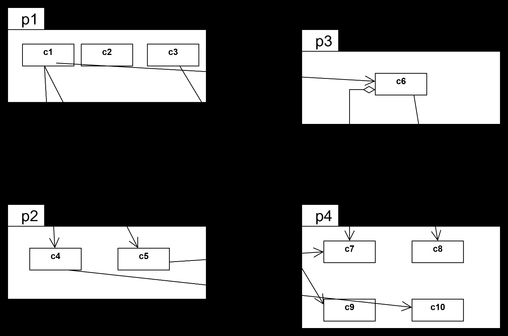

## Question
נתון מודל מחלקות שבו המחלקות בחבילה `P4` בלבד הן מופשטות (יש בכל אחת מהן לפחות פונקציה מופשטת אחת). הגדרנו סף של `1/2` עבור מדד `D'`. חשב את המדדים הרלוונטיים ובדוק האם העיצוב המתואר מפר עיקרון צימוד חבילות.  כאן יש לענות רק על שאלה 2 (אם כתבת בטעות את פתרון שאלה 2 במקום אחר, ציין זאת כאן במפורש) `Ca Ce S A D'` `P1` `P2` `P3` `P4` האם יש הפרה? אם כן, של איזה עיקרון?

## Answer
**חישוב מדדים:**

**הגדרות:**
*   `Ca` (Afferent Coupling): מספר החבילות מחוץ לחבילה הנוכחית התלויות בה.
*   `Ce` (Efferent Coupling): מספר החבילות מחוץ לחבילה הנוכחית שהיא תלויה בהן.
*   `I` (Instability): `Ce / (Ca + Ce)`. מייצג את מידת חוסר היציבות של החבילה. `I=0` יציבה לחלוטין, `I=1` לא יציבה לחלוטין.
*   `A` (Abstractness): מספר המחלקות המופשטות והממשקים בחבילה חלקי סך כל המחלקות בחבילה. `A=0` קונקרטית לחלוטין, `A=1` מופשטת לחלוטין.
*   `D'` (Distance from Main Sequence): `|A + I - 1|`. מייצג את המרחק של החבילה מהקו הראשי (Main Sequence), שבו `A+I=1`. ערך נמוך יותר מצביע על עיצוב טוב יותר. סף נתון: `0.5`.

**ניתוח תלויות מהתרשים:**
*   `P1` תלויה ב-`P2` (c1->c4, c2->c5), ב-`P3` (c3->c6) וב-`P4` (c1->c7, c2->c8, c3->c9).
*   `P2` תלויה ב-`P4` (c4->c9, c5->c10).
*   `P3` תלויה ב-`P4` (c6->c7, c6->c8).
*   `P4` אינה תלויה באף חבילה אחרת.
*   כל המחלקות ב-`P4` הן מופשטות.

**טבלת חישובים:**

| Package | Ca (Afferent Coupling) | Ce (Efferent Coupling) | I (Instability) = Ce / (Ca + Ce) | A (Abstractness) | D' = |A + I - 1| |
| :------ | :--------------------- | :--------------------- | :------------------------------- | :--------------- | :-------------------- |
| P1      | 0                      | 3 (P2, P3, P4)         | 3 / (0 + 3) = 1                  | 0                | |0 + 1 - 1| = 0         |
| P2      | 1 (P1)                 | 1 (P4)                 | 1 / (1 + 1) = 0.5                | 0                | |0 + 0.5 - 1| = 0.5       |
| P3      | 1 (P1)                 | 1 (P4)                 | 1 / (1 + 1) = 0.5                | 0                | |0 + 0.5 - 1| = 0.5       |
| P4      | 3 (P1, P2, P3)         | 0                      | 0 / (3 + 0) = 0                  | 1                | |1 + 0 - 1| = 0         |

**האם יש הפרה? אם כן, של איזה עיקרון?**

לא, אין הפרה של עיקרון צימוד החבילות (Principle of Package Coupling) כפי שנמדד על ידי `D'`. כל ערכי `D'` עבור החבילות הם `0` או `0.5`, שהם קטנים או שווים לסף הנתון של `0.5`. העיצוב עומד בדרישות.
