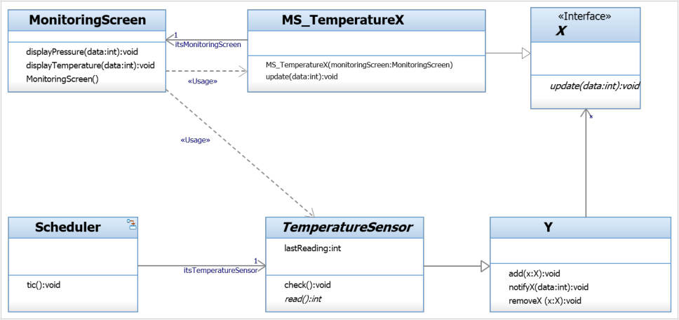

## Question
להלן תרשים מחלקות מתוך מקרה בוחן תחנת מזג האוויר.

מהן תבניות העיצוב שבאות לידי ביטוי בתרשים?

### Options
- `Adapter`-ו `Observer`
- `Bridge`-ו `Observer`
- `Bridge`-ו `AlarmClock`
- `Proxy`-ו `Observer`

## Answer
The diagram shows `TemperatureSensor` (Abstraction) and `MS_TemperatureX` (Refined Abstraction) which uses an `X` interface (Implementor) with concrete implementations `Y`. This structure is characteristic of the Bridge pattern, decoupling the abstraction from its implementation. Additionally, `MonitoringScreen` observes `MS_TemperatureX` (via `update` method), and `Y` notifies `X`s, which is a clear indication of the Observer pattern where `Y` is the Subject and `X` is the Observer interface.
