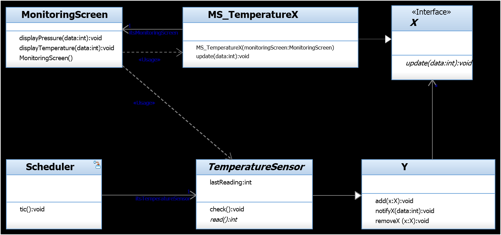

## Question
להלן תרשים מחלקות מתוך מקרה בוחן תחנת מזג האוויר.

מהן תבניות העיצוב שבאות לידי ביטוי בתרשים?

### Options
- `Adapter`-ו `Observer`
- `Bridge`-ו `Observer`
- `Bridge`-ו `AlarmClock`
- `Proxy`-ו `Observer`

## Answer
התרשים מציג שתי תבניות עיצוב עיקריות:
1.  **Observer Pattern:** המחלקות `MonitoringScreen` ו-`MS_TemperatureX` הן `Observers` (או `Concrete Observers`) המקבלות עדכונים מ-`TemperatureSensor` (ה-`Subject`). המחלקה `Y` היא כנראה `Subject` או `Observer` כללי יותר. `X` הוא ממשק ה-`Observer`.
2.  **Adapter Pattern:** המחלקה `MS_TemperatureX` היא `Adapter` שמקבלת `MonitoringScreen` בקונסטרוקטור שלה ומממשת את ממשק `X` (ה-`Observer`). היא מתאימה את הממשק של `MonitoringScreen` לממשק הנדרש על ידי `X` (ה-`Observer`).
לכן, התבניות הן `Adapter` ו-`Observer`.
