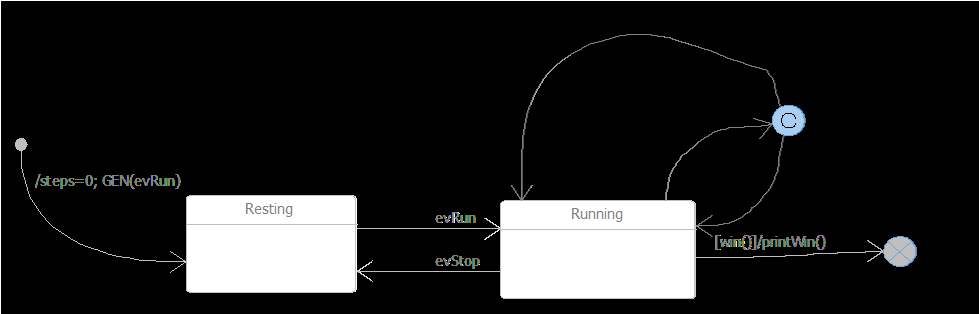
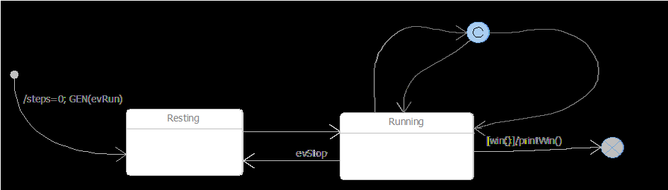
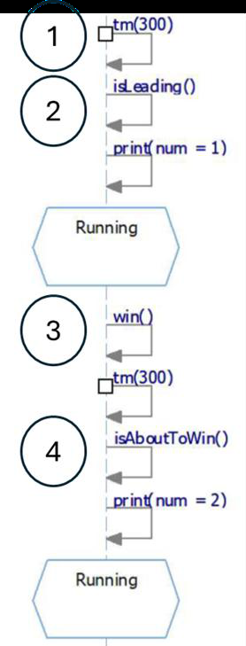

## Question
נתון קטע מתרשים הרצף שנפלה בו טעות במיקום אחד

איפה הטעות?

### Options
- מיקום 4
- מיקום 1
- מיקום 2
- מיקום 3

## Answer
הטעות נמצאת במיקום 4. הפעולה `print(num = 2)` צריכה להיות חלק מהפעולה `isAboutToWin()` ולא פעולה נפרדת לאחר מכן. בדרך כלל, פעולות בתוך מצב או מעבר מבוצעות כחלק מהאירוע או התנאי, או כפעולת כניסה/יציאה מהמצב. הצבת `print(num = 2)` כפעולה נפרדת לאחר `isAboutToWin()` אינה תואמת את התחביר הסטנדרטי של תרשימי מצבים.
