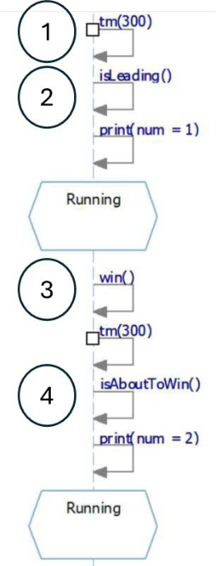

## Question
נתונים תרשימי המצבים עבור מקרה הבוחן 'הצב והארנב' שנלמד בכיתה.

נתון קטע מתרשים הרצף שנפלה בו טעות במיקום אחד
איפה הטעות?

### Options
- מיקום 4
- מיקום 1
- מיקום 2
- מיקום 3

## Answer
At position 4, the `isAboutToWin()` guard condition should be checked before `print(num = 2)`. The current diagram shows `print(num = 2)` happening unconditionally after `tm(300)` and then `isAboutToWin()` is checked, which is incorrect for a guard condition.
