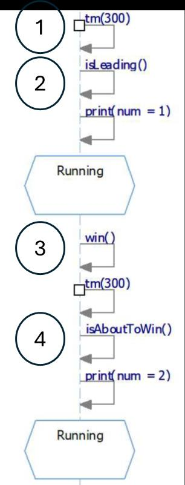

## Question
נתונים תרשימי המצבים עבור מקרה הבוחן 'הצב והארנב' שנלמד בכיתה.

נתון קטע מתרשים הרצף שנפלה בו טעות במיקום אחד

איפה הטעות?

### Options
- מיקום 4
- מיקום 1
- מיקום 2
- מיקום 3

## Answer
הטעות נמצאת במיקום 4. הפעולה `isAboutToWin()` צריכה להיות לפני `tm(300)` ולא אחריו, שכן היא קובעת אם המצב הבא הוא ניצחון או המשך ריצה רגילה, והטיימר קשור למשך הריצה. בסדר פעולות הגיוני, יש לבדוק את התנאי לפני שמפעילים טיימר או פעולה שתלויה בתוצאת הבדיקה.
