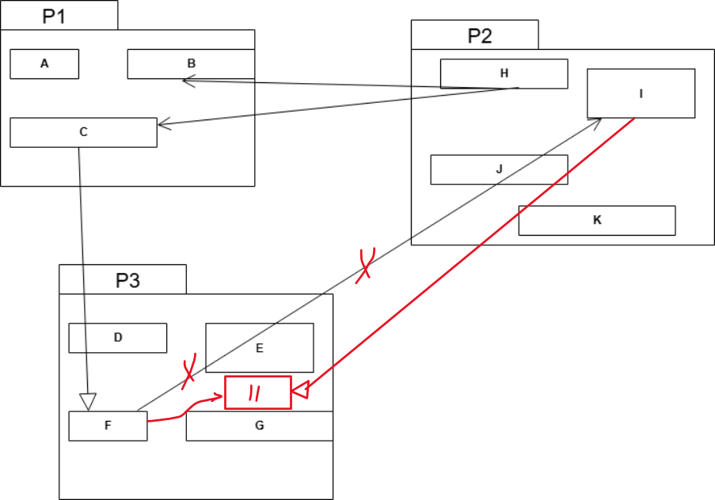

## Question
(2 נקודות) איזה עיקרון בעיצוב חבילות מופר בתרשים שלפניך?(5 נקודות) כיצד ניתן לתקן זאת ללא העברה של מחלקות מחבילה לחבילה? שרטט תרשים חדש. אין צורך לשרטט מחדש חלקים בתרשים שלא השתנו. הסבר כיצד השינוי פותר את ההפרה.

## Answer
העיקרון המופר בתרשים הוא **עיקרון התלות הבלתי-מחזורית (Acyclic Dependencies Principle - ADP)**.

**הסבר ההפרה:**
התרשים מציג תלות מחזורית בין החבילות P1, P2 ו-P3:
*   P1 תלוי ב-P2 (לדוגמה, A תלוי ב-H, C תלוי ב-J).
*   P2 תלוי ב-P3 (לדוגמה, J תלוי ב-D, K תלוי ב-G).
*   P3 תלוי ב-P1 (לדוגמה, D תלוי ב-B).

שרשרת התלויות היא P1 -> P2 -> P3 -> P1, מה שיוצר מחזור תלויות. מחזוריות כזו מקשה על הבנה, בדיקה ותחזוקה של המערכת, ומונעת קומפילציה נפרדת של חבילות.

**תיקון ההפרה (ללא העברת מחלקות):**
כדי לתקן את ההפרה מבלי להעביר מחלקות קיימות בין חבילות, נשתמש ב**עיקרון היפוך התלויות (Dependency Inversion Principle - DIP)** כדי לשבור את התלות מ-P3 ל-P1 (התלות של D ב-B).

1.  **יצירת חבילה חדשה:** ניצור חבילה חדשה בשם `P_Interfaces`.
2.  **הוצאת ממשק:** נוציא ממשק, נניח `IB_Service`, מהמחלקה `B` שבחבילה `P1`. ממשק זה יכלול את המתודות שבהן המחלקה `D` שבחבילה `P3` משתמשת מ-`B`.
3.  **מיקום הממשק:** נמקם את הממשק `IB_Service` בחבילה החדשה `P_Interfaces`.
4.  **שינוי תלות ב-P3:** נשנה את המחלקה `D` שבחבילה `P3` כך שתהיה תלויה בממשק `IB_Service` (שנמצא ב-`P_Interfaces`) במקום ישירות במחלקה `B` (שנמצאת ב-`P1`).
5.  **יישום ממשק ב-P1:** נשנה את המחלקה `B` שבחבילה `P1` כך שתממש את הממשק `IB_Service` (שנמצא ב-`P_Interfaces`).

**הסבר כיצד השינוי פותר את ההפרה:**
השינוי מבטל את התלות הישירה של P3 ב-P1. במקום זאת, גם P1 וגם P3 תלויים כעת בחבילה החדשה `P_Interfaces`.

**לפני התיקון:** P1 -> P2 -> P3 -> P1
**אחרי התיקון:**
*   P1 עדיין תלוי ב-P2.
*   P2 עדיין תלוי ב-P3.
*   P3 תלוי כעת ב-`P_Interfaces` (כי D משתמש ב-`IB_Service`).
*   P1 תלוי כעת ב-`P_Interfaces` (כי B מממש את `IB_Service`).

שרשרת התלויות החדשה היא P1 -> P2 -> P3 -> P_Interfaces וגם P1 -> P_Interfaces. אין יותר מחזור תלויות ישיר בין P1, P2 ו-P3. בכך נשבר המחזור והמערכת עומדת בעיקרון ADP.

**תרשים מחלקות מתוקן (חלקים רלוונטיים):**

```mermaid
classDiagram
    direction LR

    package P1 {
        class A
        class B {
            <<implements>> IB_Service
        }
        A --> H
        C --> J
        B --|> IB_Service
    }

    package P2 {
        class H
        class J
        class K
        J --> D
        K --> G
    }

    package P3 {
        class D {
            D --> IB_Service
        }
        class E
        class F
        class G
    }

    package P_Interfaces {
        interface IB_Service
    }

    P1 --> P2
    P2 --> P3
    P3 --> P_Interfaces
    P1 --> P_Interfaces
```
