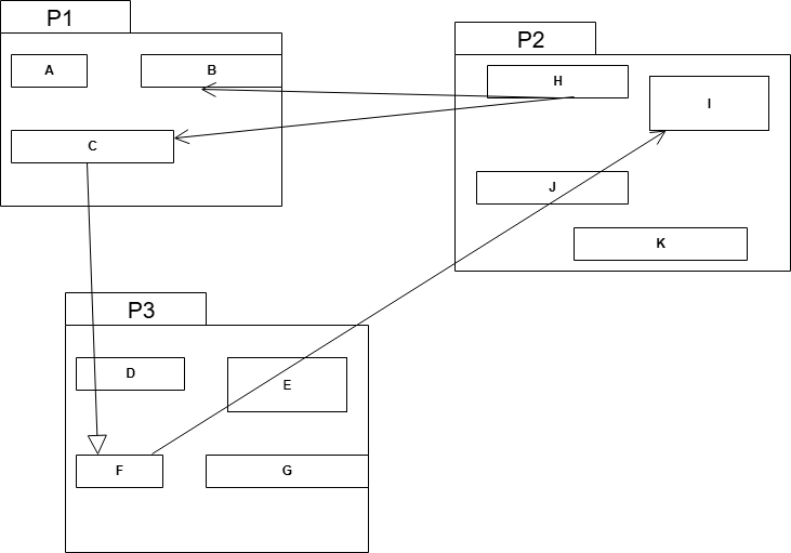

## Question
שאלה 2 (7 נקודות):
(2 נקודות) איזה עיקרון בעיצוב חבילות מופר בתרשים שלפניך?

(5 נקודות) כיצד ניתן לתקן זאת ללא העברה של מחלקות מחבילה לחבילה? שרטט תרשים חדש. אין צורך לשרטט מחדש חלקים בתרשים שלא השתנו. הסבר כיצד השינוי פותר את ההפרה.

## Answer
פתרון:
העקרון שמופר הוא ADP. ניתן להוסיף כי ברגע ש ADP מופר, יש הפרה נגררת של כל העקרונות האחרים, כי למעשה מדובר בחבילה אחת גדולה שחייבים להשתמש בכל החבילות יחד וחייבים לשחרר אותן יחד. אין להוריד ניקוד למי שכתב עקרונות בנוסף ל ADP

תיקון: הוספת ממשק בחבילה מסוימת והיפוך התלות. לדוגמא, הוספת ממשק `II` לחבילה `P3`. המחלקה `F` תחזיק מצביע ל `II` ומהחלקה `I` תממש את הממשק `II`. אפשרות נוספת – להוסיף חבילה רביעית שבתוכה ממשק ש `F` ו `I` יירשו ממנה.

