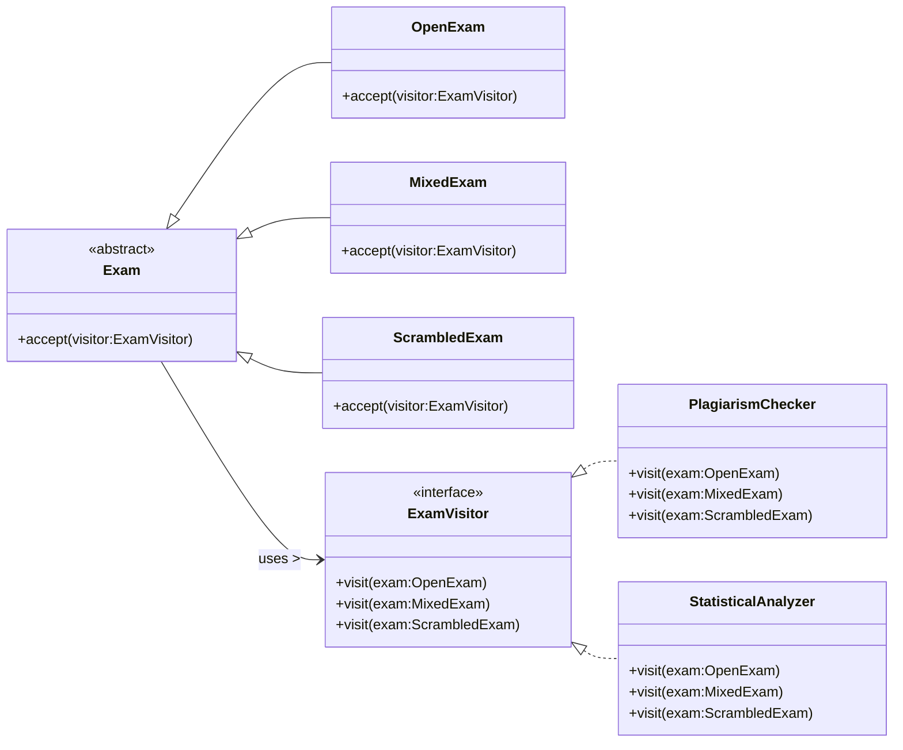

## Question
במערכת לניהול בחינות ישנה מחלקה מופשטת Exam המייצגת בחינה. ישנם מספר תתי סוגים שונים של בחינות: MixedExam, OpenExam, ScrambledExam וכן הלאה.סעיף א (10 נקודות)נתבקשנו להוסיף למערכת תמיכה בהוספה עתידית של פעולות שניתן להפעיל על מופעים של בחינות, אך אינן תחת האחריות הישירה של Exam. להלן שתי פעולות לדוגמא:פעולה שבודקת האם יש חשד להעתקות במחברות של בחינה. הפעולה תומכת ב- MixedExam-וב ScrambledExamפעולה שמבצעת בדיקות סטטיסטיות לא שגרתיות על מופע של בחינה מסומת. הפעולה תומכת ב OpenExam-וב ScrambledExamחשוב להדגיש כי עבור סוגים שונים של בחינות יש דרך שונה לבצע את הפעולות.הערה: מערכת ניהול בדיקת הבחינות הולכת ומתפתחת משנה לשנה, ויש צפי להוספת סוגי בחינות חדשות בעתיד.השתמש בתבניות עיצוב שנלמדו בכיתה על מנת לממש את המערכת המתוארת על פי הדרישות. צייר תרשים מחלקות המבוסס על תבניות עיצוב שלמדת שתומך בדרישות. כתוב את שם תבניות העיצוב שהשתמשת בהן. כתוב את הקוד עבור המחלקות שציירת. אין צורך לממש את תוכן הפעולות עצמן, אלא רק את התבנית שמאפשרת להפעיל אותן.

## Answer
תבנית העיצוב המתאימה ביותר לדרישות אלו היא **Visitor Pattern**.

**הסבר:**
דרישות המערכת מצביעות על צורך להוסיף פעולות חדשות על היררכיית אובייקטים קיימת (סוגי הבחינות: `OpenExam`, `MixedExam`, `ScrambledExam`, וכו') מבלי לשנות את המחלקות הקיימות עצמן. בנוסף, הפעולות הללו תלויות בסוג הספציפי של הבחינה. תבנית ה-Visitor מאפשרת להגדיר פעולות חדשות על מבנה אובייקטים מבלי לשנות את המחלקות של האובייקטים שעליהם הפעולות פועלות. זה תואם לעיקרון ה-Open/Closed Principle (OCP) - פתוח להרחבה, סגור לשינוי.

**תרשים מחלקות (UML Conceptual Diagram):**


**קוד עבור המחלקות (מבנה בלבד):**

```java
// 1. The Visitor Interface
interface ExamVisitor {
    void visit(OpenExam exam);
    void visit(MixedExam exam);
    void visit(ScrambledExam exam);
    // Add visit methods for any new Exam types
}

// 2. The Abstract Element (Exam)
abstract class Exam {
    public abstract void accept(ExamVisitor visitor);
}

// 3. Concrete Elements (Exam Subtypes)
class OpenExam extends Exam {
    // Exam specific properties and methods
    @Override
    public void accept(ExamVisitor visitor) {
        visitor.visit(this);
    }
}

class MixedExam extends Exam {
    // Exam specific properties and methods
    @Override
    public void accept(ExamVisitor visitor) {
        visitor.visit(this);
    }
}

class ScrambledExam extends Exam {
    // Exam specific properties and methods
    @Override
    public void accept(ExamVisitor visitor) {
        visitor.visit(this);
    }
}

// 4. Concrete Visitors (New Operations)
class PlagiarismChecker implements ExamVisitor {
    @Override
    public void visit(OpenExam exam) {
        // Logic for checking plagiarism in OpenExam
        System.out.println("Checking plagiarism for OpenExam: " + exam.getClass().getSimpleName());
    }

    @Override
    public void visit(MixedExam exam) {
        // Logic for checking plagiarism in MixedExam
        System.out.println("Checking plagiarism for MixedExam: " + exam.getClass().getSimpleName());
    }

    @Override
    public void visit(ScrambledExam exam) {
        // Logic for checking plagiarism in ScrambledExam
        System.out.println("Checking plagiarism for ScrambledExam: " + exam.getClass().getSimpleName());
    }
}

class StatisticalAnalyzer implements ExamVisitor {
    @Override
    public void visit(OpenExam exam) {
        // Logic for statistical analysis of OpenExam
        System.out.println("Performing statistical analysis for OpenExam: " + exam.getClass().getSimpleName());
    }

    @Override
    public void visit(MixedExam exam) {
        // Logic for statistical analysis of MixedExam
        System.out.println("Performing statistical analysis for MixedExam: " + exam.getClass().getSimpleName());
    }

    @Override
    public void visit(ScrambledExam exam) {
        // Logic for statistical analysis of ScrambledExam
        System.out.println("Performing statistical analysis for ScrambledExam: " + exam.getClass().getSimpleName());
    }
}

// Example Usage:
public class ExamSystem {
    public static void main(String[] args) {
        List<Exam> exams = List.of(
            new OpenExam(),
            new MixedExam(),
            new ScrambledExam()
        );

        ExamVisitor plagiarismChecker = new PlagiarismChecker();
        ExamVisitor statisticalAnalyzer = new StatisticalAnalyzer();

        for (Exam exam : exams) {
            exam.accept(plagiarismChecker);
            exam.accept(statisticalAnalyzer);
        }
    }
}
```
