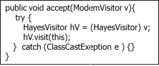

## Question
שאלה 3 (20 נקודות):
במערכת לניהול בחינות ישנה מחלקה מופשטת `Exam` המייצגת בחינה. ישנם מספר תתי סוגים שונים של בחינות: `ScrambledExam`, `OpenExam`, `MixedExam` וכן הלאה.

סעיף א (10 נקודות)
נתבקשנו להוסיף למערכת תמיכה בהוספה עתידית של פעולות שניתן להפעיל על מופעים של בחינות, אך אינן תחת האחריות הישירה של `Exam`. להלן שתי פעולות לדוגמא:
* פעולה שבודקת האם יש חשד להעתקות במחברות של בחינה. הפעולה תומכת ב- `MixedExam`-וב `ScrambledExam`
* פעולה שמבצעת בדיקות סטטיסטיות לא שגרתיות על מופע של בחינה מסומת. הפעולה תומכת ב `OpenExam`-וב `ScrambledExam`

חשוב להדגיש כי עבור סוגים שונים של בחינות יש דרך שונה לבצע את הפעולות.
הערה: מערכת ניהול בדיקת הבחינות הולכת ומתפתחת משנה לשנה, ויש צפי להוספת סוגי בחינות חדשות בעתיד.

השתמש בתבניות עיצוב שנלמדו בכיתה על מנת לממש את המערכת המתוארת על פי הדרישות.
צייר תרשים מחלקות המבוסס על תבניות עיצוב שלמדת שתומך בדרישות. כתוב את שם תבניות העיצוב שהשתמשת בהן. כתוב את הקוד עבור המחלקות שציירת. אין צורך לממש את תוכן הפעולות עצמן, אלא רק את התבנית שמאפשרת להפעיל אותן.

כאן יש לענות רק על שאלה 3א (אם כתבת בטעות את פתרון שאלה 3א במקום אחר, ציין זאת כאן במפורש)

## Answer
פתרון:
נשתמש בתבנית `Acyclic Visitor`. זהה למה שנלמד בכיתה (במקום מודם בחינה, ובמקום קונפיגורציה "בדיקת העתקות" ו"סטטיסטיקות")

```java
public void accept(ModemVisitor v){
    try {
        HayesVisitor hV = (HayesVisitor) v;
        hV.visit(this);
    } catch (ClassCastExeption e) {}
}

public void visit(ZoomModem z){
    z.configurationString = "&s1=4&D=3";
}
```
