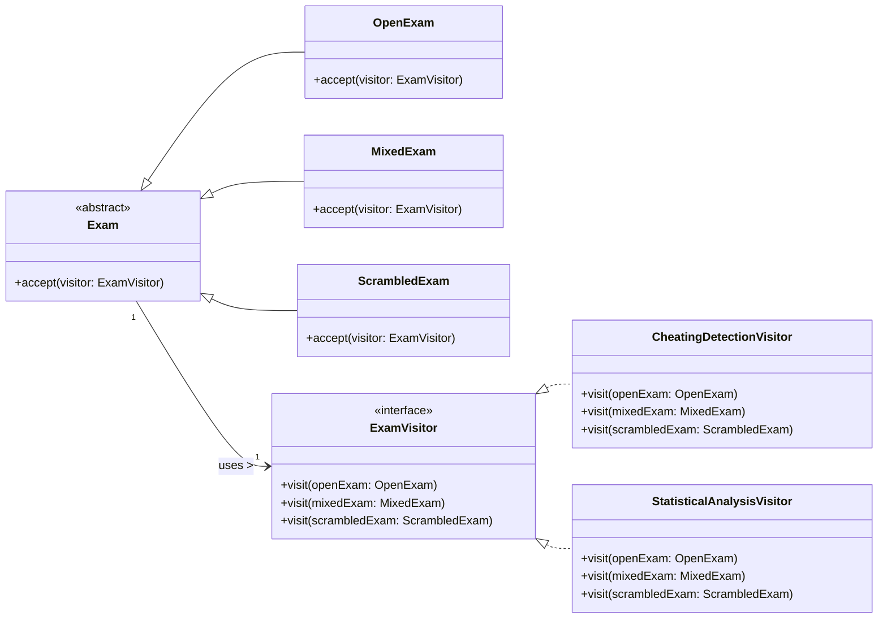

## Question
במערכת לניהול בחינות ישנה מחלקה מופשטת `Exam` המייצגת בחינה. ישנם מספר תתי סוגים שונים של בחינות: `MixedExam`, `OpenExam`, `ScrambledExam` וכן הלאה. סעיף א (10 נקודות) נתבקשנו להוסיף למערכת תמיכה בהוספה עתידית של פעולות שניתן להפעיל על מופעים של בחינות, אך אינן תחת האחריות הישירה של `Exam`. להלן שתי פעולות לדוגמא : * פעולה שבודקת האם יש חשד להעתקות במחברות של בחינה. הפעולה תומכת ב- `MixedExam`-וב `ScrambledExam` * פעולה שמבצעת בדיקות סטטיסטיות לא שגרתיות על מופע של בחינה מסומת. הפעולה תומכת ב `OpenExam`-וב `ScrambledExam` חשוב להדגיש כי עבור סוגים שונים של בחינות יש דרך שונה לבצע את הפעולות. הערה: מערכת ניהול בדיקת הבחינות הולכת ומתפתחת משנה לשנה, ויש צפי להוספת סוגי בחינות חדשות בעתיד. השתמש בתבניות עיצוב שנלמדו בכיתה על מנת לממש את המערכת המתוארת על פי הדרישות. צייר תרשים מחלקות המבוסס על תבניות עיצוב שלמדת שתומך בדרישות. כתוב את שם תבניות העיצוב שהשתמשת בהן. כתוב את הקוד עבור המחלקות שציירת. אין צורך לממש את תוכן הפעולות עצמן, אלא רק את התבנית שמאפשרת להפעיל אותן.

## Answer
הבעיה המתוארת, שבה יש היררכיית אובייקטים קיימת (`Exam` ותתי-המחלקות שלו) וצורך להוסיף פעולות חדשות על אובייקטים אלה מבלי לשנות את ההיררכיה הקיימת, היא מקרה קלאסי לשימוש ב**תבנית העיצוב Visitor (מבקר)**.

**שם תבנית העיצוב:** Visitor Pattern

**הסבר:**
תבנית ה-Visitor מאפשרת להגדיר פעולה חדשה על אלמנטים של היררכיית אובייקטים מבלי לשנות את המחלקות של האלמנטים עצמם. במקום זאת, הפעולה מוגדרת במחלקת Visitor נפרדת. כל אלמנט בהיררכיה 'מקבל' את ה-Visitor, וה-Visitor מבצע את הפעולה הספציפית עבור סוג האלמנט.

**תרשים מחלקות (UML):**



**קוד עבור המחלקות:**

```java
// 1. Element Abstract Class
public abstract class Exam {
    public abstract void accept(ExamVisitor visitor);
}

// 2. Concrete Elements
public class OpenExam extends Exam {
    @Override
    public void accept(ExamVisitor visitor) {
        visitor.visit(this);
    }
}

public class MixedExam extends Exam {
    @Override
    public void accept(ExamVisitor visitor) {
        visitor.visit(this);
    }
}

public class ScrambledExam extends Exam {
    @Override
    public void accept(ExamVisitor visitor) {
        visitor.visit(this);
    }
}

// 3. Visitor Interface
public interface ExamVisitor {
    void visit(OpenExam openExam);
    void visit(MixedExam mixedExam);
    void visit(ScrambledExam scrambledExam);
}

// 4. Concrete Visitors
public class CheatingDetectionVisitor implements ExamVisitor {
    @Override
    public void visit(OpenExam openExam) {
        // פעולה זו אינה נתמכת עבור OpenExam, או מימוש ברירת מחדל
        System.out.println("Cheating detection not applicable for OpenExam");
    }

    @Override
    public void visit(MixedExam mixedExam) {
        // מימוש בדיקת העתקות עבור MixedExam
        System.out.println("Performing cheating detection for MixedExam");
    }

    @Override
    public void visit(ScrambledExam scrambledExam) {
        // מימוש בדיקת העתקות עבור ScrambledExam
        System.out.println("Performing cheating detection for ScrambledExam");
    }
}

public class StatisticalAnalysisVisitor implements ExamVisitor {
    @Override
    public void visit(OpenExam openExam) {
        // מימוש בדיקות סטטיסטיות עבור OpenExam
        System.out.println("Performing statistical analysis for OpenExam");
    }

    @Override
    public void visit(MixedExam mixedExam) {
        // פעולה זו אינה נתמכת עבור MixedExam, או מימוש ברירת מחדל
        System.out.println("Statistical analysis not applicable for MixedExam");
    }

    @Override
    public void visit(ScrambledExam scrambledExam) {
        // מימוש בדיקות סטטיסטיות עבור ScrambledExam
        System.out.println("Performing statistical analysis for ScrambledExam");
    }
}

// דוגמת שימוש (לא נדרש בשאלה, אך להמחשה)
public class Main {
    public static void main(String[] args) {
        List<Exam> exams = List.of(
                new OpenExam(),
                new MixedExam(),
                new ScrambledExam()
        );

        ExamVisitor cheatingDetector = new CheatingDetectionVisitor();
        ExamVisitor statsAnalyzer = new StatisticalAnalysisVisitor();

        System.out.println("--- Running Cheating Detection ---");
        for (Exam exam : exams) {
            exam.accept(cheatingDetector);
        }

        System.out.println("\n--- Running Statistical Analysis ---");
        for (Exam exam : exams) {
            exam.accept(statsAnalyzer);
        }
    }
}
```
