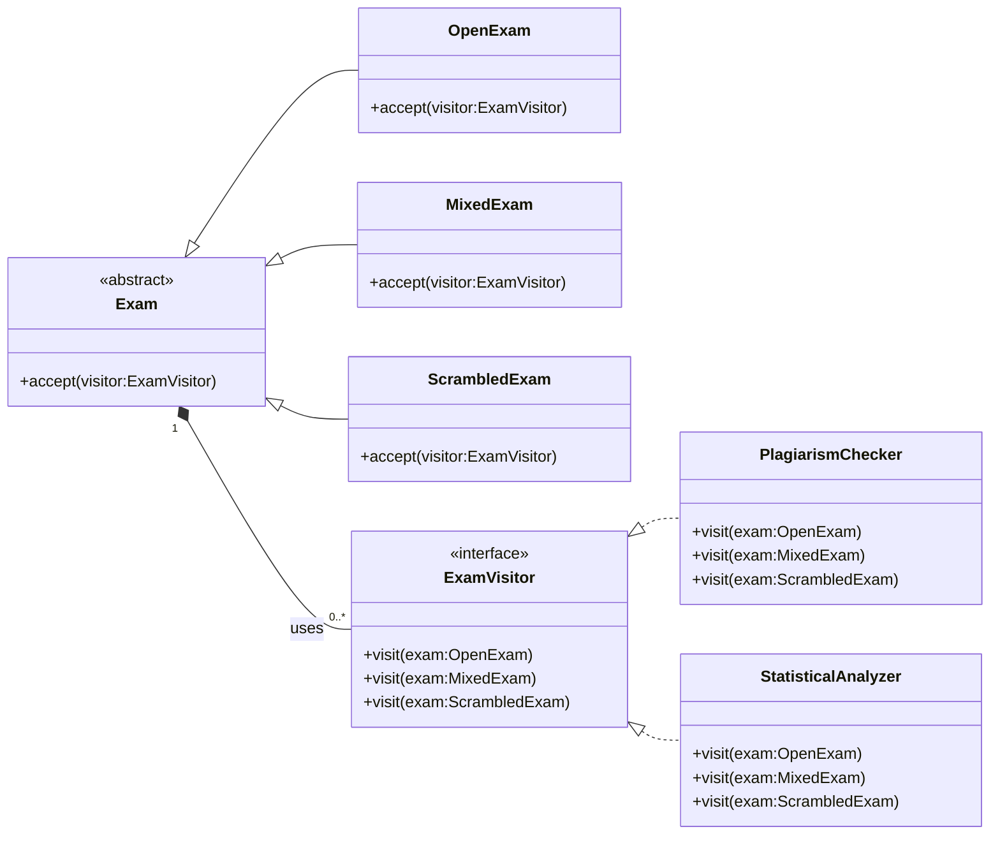

## Question
במערכת לניהול בחינות ישנה מחלקה מופשטת `Exam` המייצגת בחינה. ישנם מספר תתי סוגים שונים של בחינות: `MixedExam`, `OpenExam`, `ScrambledExam` וכן הלאה.
**סעיף א (10 נקודות)**
נתבקשנו להוסיף למערכת תמיכה בהוספה עתידית של פעולות שניתן להפעיל על מופעים של בחינות, אך אינן תחת האחריות הישירה של `Exam`. להלן שתי פעולות לדוגמא :
*   פעולה שבודקת האם יש חשד להעתקות במחברות של בחינה. הפעולה תומכת ב- `MixedExam`-וב `ScrambledExam`
*   פעולה שמבצעת בדיקות סטטיסטיות לא שגרתיות על מופע של בחינה מסומת. הפעולה תומכת ב `OpenExam`-וב `ScrambledExam`
חשוב להדגיש כי עבור סוגים שונים של בחינות יש דרך שונה לבצע את הפעולות.
הערה: מערכת ניהול בדיקת הבחינות הולכת ומתפתחת משנה לשנה, ויש צפי להוספת סוגי בחינות חדשות בעתיד.
השתמש בתבניות עיצוב שנלמדו בכיתה על מנת לממש את המערכת המתוארת על פי הדרישות.
צייר תרשים מחלקות המבוסס על תבניות עיצוב שלמדת שתומך בדרישות. כתוב את שם תבניות העיצוב שהשתמשת בהן. כתוב את הקוד עבור המחלקות שציירת. אין צורך לממש את תוכן הפעולות עצמן, אלא רק את התבנית שמאפשרת להפעיל אותן.

**סעיף ב (10 נקודות)**
במכללה מסוימת, המשתמשת במערכת הנייל, רוצים מדי פעם לשמור מופעי בחינות במבנה נתונים. אחד השימושים האפשריים במבני הנתונים הוא למשל לשמור את כל מופעי הבחינות שהתקיימו בסמסטר מסוים במחלקת מחשבים.
נתונות הדרישות הבאות :
*   הקליינט יוכל להוסיף בחינות למבנה הנתונים.
*   לא להיות מוגבלים למבנה נתונים ספציפי. דהיינו, יהיה ניתן להחליף את מבנה הנתונים בלי שיהיה צורך לשנות את הקוד של הקליינט שניגש לנתונים.
*   הקליינט יוכל לעבור על כל מופעי הבחינות, בלי להיות תלוי כלל במבנה הנתונים הספציפי שבו השתמשו.
הניחו כי למחלקה `Exam` יש פונקציה מופשטת `check`. נרצה שהקוד הבא יעבוד בצורה תקינה :
`public void checkAllExams(ExamContainer examContainer){`
`for (Exam exam: examContainer){`
`exam.check();`
`}`
`}`
יש לתכנן את המחלקה `ExamContainer` כך שמבנה הנתונים הפנימי שלה יהיה ניתן להחלפה ללא צורך לקמפל מחדש את הקוד שלה. ניתן להשתמש במחלקות המוגדרות באופן מובנה בשפת `Java`.
השתמש בתבניות עיצוב שנלמדו בכיתה על מנת לממש את המערכת המתוארת על פי הדרישות.
צייר תרשים מחלקות המבוסס על תבניות עיצוב שלמדת שתומך בדרישות. כתוב את שם תבניות העיצוב שהשתמשת בהן. כתוב את הקוד עבור המחלקות שציירת. ממש פונקציה ראשית שבה מאתחלים מופע של `ExamContainer` המתבסס על רשימה מקושרת (`LinkedList`) ומוסיפים למבנה הנתונים שלושה מופעים של בחינה (מסוגים לבחירתך).

## Answer
**פתרון סעיף א:**
בעיה זו מתארת מצב שבו יש להוסיף פעולות חדשות להיררכיה קיימת של סוגי `Exam` (`MixedExam`, `OpenExam`, `ScrambledExam`) מבלי לשנות את מחלקות ה-`Exam` עצמן. הפעולות גם בעלות מימושים שונים עבור סוגי `Exam` שונים. זהו מקרה שימוש קלאסי עבור **תבנית העיצוב Visitor**.

**תבנית עיצוב בשימוש:** Visitor Pattern

**תרשים מחלקות UML:**


**מבנה הקוד:**
```java
import java.util.List;

// 1. The abstract Exam class (Element)
public abstract class Exam {
    public abstract void accept(ExamVisitor visitor);
}

// 2. Concrete Exam classes (Concrete Elements)
public class OpenExam extends Exam {
    @Override
    public void accept(ExamVisitor visitor) {
        visitor.visit(this);
    }
    // Other OpenExam specific methods/fields
}

public class MixedExam extends Exam {
    @Override
    public void accept(ExamVisitor visitor) {
        visitor.visit(this);
    }
    // Other MixedExam specific methods/fields
}

public class ScrambledExam extends Exam {
    @Override
    public void accept(ExamVisitor visitor) {
        visitor.visit(this);
    }
    // Other ScrambledExam specific methods/fields
}

// 3. The Visitor Interface
public interface ExamVisitor {
    void visit(OpenExam exam);
    void visit(MixedExam exam);
    void visit(ScrambledExam exam);
    // Add visit methods for any new Exam types
}

// 4. Concrete Visitor Implementations
public class PlagiarismChecker implements ExamVisitor {
    @Override
    public void visit(OpenExam exam) {
        // Plagiarism check logic for OpenExam (if applicable, otherwise empty or throw UnsupportedOperationException)
        System.out.println("Performing plagiarism check for OpenExam.");
    }

    @Override
    public void visit(MixedExam exam) {
        // Plagiarism check logic for MixedExam
        System.out.println("Performing plagiarism check for MixedExam.");
    }

    @Override
    public void visit(ScrambledExam exam) {
        // Plagiarism check logic for ScrambledExam
        System.out.println("Performing plagiarism check for ScrambledExam.");
    }
}

public class StatisticalAnalyzer implements ExamVisitor {
    @Override
    public void visit(OpenExam exam) {
        // Statistical analysis logic for OpenExam
        System.out.println("Performing statistical analysis for OpenExam.");
    }

    @Override
    public void visit(MixedExam exam) {
        // Statistical analysis logic for MixedExam (if applicable, otherwise empty or throw UnsupportedOperationException)
        System.out.println("Performing statistical analysis for MixedExam.");
    }

    @Override
    public void visit(ScrambledExam exam) {
        // Statistical analysis logic for ScrambledExam
        System.out.println("Performing statistical analysis for ScrambledExam.");
    }
}

// Example Usage:
public class ClientA {
    public static void main(String[] args) {
        List<Exam> exams = List.of(new OpenExam(), new MixedExam(), new ScrambledExam());

        ExamVisitor plagiarismChecker = new PlagiarismChecker();
        ExamVisitor statisticalAnalyzer = new StatisticalAnalyzer();

        for (Exam exam : exams) {
            exam.accept(plagiarismChecker);
            exam.accept(statisticalAnalyzer);
        }
    }
}
```

**פתרון סעיף ב:**
לבעיה זו יש שתי דרישות עיקריות:
1.  **מבנה נתונים פנימי גמיש:** ה-`ExamContainer` צריך לאפשר החלפה של מבנה הנתונים הפנימי שלו מבלי לשנות את קוד הלקוח. זה מצביע על **תבנית Strategy** או **Bridge** עבור מנגנון האחסון. בהינתן ההקשר של 
