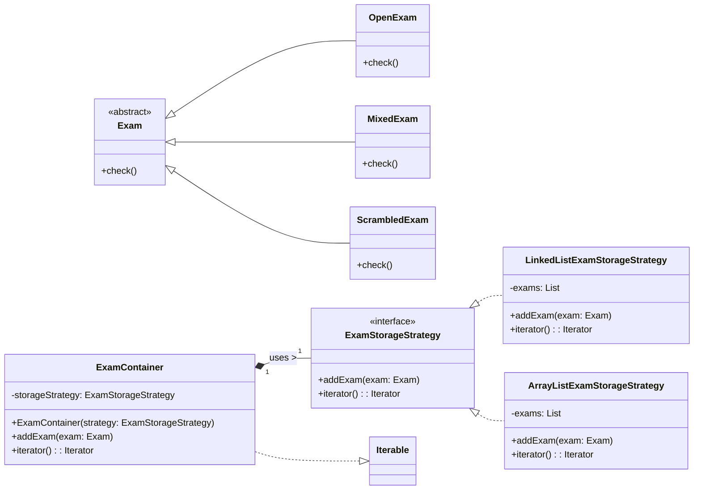

## Question
סעיף ב (10 נקודות) במכללה מסוימת, המשתמשת במערכת הנייל, רוצים מדי פעם לשמור מופעי בחינות במבנה נתונים. אחד השימושים האפשריים במבני הנתונים הוא למשל לשמור את כל מופעי הבחינות שהתקיימו בסמסטר מסוים במחלקת מחשבים. נתונות הדרישות הבאות : * הקליינט יוכל להוסיף בחינות למבנה הנתונים. * לא להיות מוגבלים למבנה נתונים ספציפי. דהיינו, יהיה ניתן להחליף את מבנה הנתונים בלי שיהיה צורך לשנות את הקוד של הקליינט שניגש לנתונים. * הקליינט יוכל לעבור על כל מופעי הבחינות, בלי להיות תלוי כלל במבנה הנתונים הספציפי שבו השתמשו. הניחו כי למחלקה `Exam` יש פונקציה מופשטת `check`. נרצה שהקוד הבא יעבוד בצורה תקינה : `public void checkAllExams(ExamContainer examContainer){ for (Exam exam: examContainer){ exam.check(); } }` יש לתכנן את המחלקה `ExamContainer` כך שמבנה הנתונים הפנימי שלה יהיה ניתן להחלפה ללא צורך לקמפל מחדש את הקוד שלה. ניתן להשתמש במחלקות המוגדרות באופן מובנה בשפת `Java`. השתמש בתבניות עיצוב שנלמדו בכיתה על מנת לממש את המערכת המתוארת על פי הדרישות. צייר תרשים מחלקות המבוסס על תבניות עיצוב שלמדת שתומך בדרישות. כתוב את שם תבניות העיצוב שהשתמשת בהן. כתוב את הקוד עבור המחלקות שציירת. ממש פונקציה ראשית שבה מאתחלים מופע של `ExamContainer` המתבסס על רשימה מקושרת (`LinkedList`) ומוסיפים למבנה הנתונים שלושה מופעים של בחינה (מסוגים לבחירתך).

## Answer
הדרישות בשאלה מצביעות על שימוש בשתי תבניות עיצוב עיקריות:
1.  **Strategy Pattern (תבנית אסטרטגיה):** כדי לאפשר החלפה של מבנה הנתונים הפנימי של `ExamContainer` מבלי לשנות את הקוד של הלקוח.
2.  **Iterator Pattern (תבנית איטרטור):** כדי לאפשר ללקוח לעבור על כל מופעי הבחינות ב-`ExamContainer` מבלי להיות תלוי במבנה הנתונים הפנימי. הדרישה לקוד `for (Exam exam: examContainer)` מחייבת את `ExamContainer` לממש את ממשק `Iterable`.

**שמות תבניות העיצוב:** Strategy Pattern, Iterator Pattern

**תרשים מחלקות (UML):**



**קוד עבור המחלקות:**

```java
import java.util.ArrayList;
import java.util.Iterator;
import java.util.LinkedList;
import java.util.List;

// 1. Exam Hierarchy (simplified from Part A for check() method)
public abstract class Exam {
    public abstract void check();
}

public class OpenExam extends Exam {
    @Override
    public void check() {
        System.out.println("Checking OpenExam");
    }
}

public class MixedExam extends Exam {
    @Override
    public void check() {
        System.out.println("Checking MixedExam");
    }
}

public class ScrambledExam extends Exam {
    @Override
    public void check() {
        System.out.println("Checking ScrambledExam");
    }
}

// 2. Strategy Interface for Exam Storage
public interface ExamStorageStrategy {
    void addExam(Exam exam);
    Iterator<Exam> iterator();
}

// 3. Concrete Strategy: LinkedList implementation
public class LinkedListExamStorageStrategy implements ExamStorageStrategy {
    private List<Exam> exams = new LinkedList<>();

    @Override
    public void addExam(Exam exam) {
        exams.add(exam);
    }

    @Override
    public Iterator<Exam> iterator() {
        return exams.iterator();
    }
}

// 4. Concrete Strategy: ArrayList implementation (example of another strategy)
public class ArrayListExamStorageStrategy implements ExamStorageStrategy {
    private List<Exam> exams = new ArrayList<>();

    @Override
    public void addExam(Exam exam) {
        exams.add(exam);
    }

    @Override
    public Iterator<Exam> iterator() {
        return exams.iterator();
    }
}

// 5. Context Class: ExamContainer (implements Iterable for Iterator Pattern)
public class ExamContainer implements Iterable<Exam> {
    private ExamStorageStrategy storageStrategy;

    public ExamContainer(ExamStorageStrategy strategy) {
        this.storageStrategy = strategy;
    }

    public void addExam(Exam exam) {
        storageStrategy.addExam(exam);
    }

    // Allows iteration using for-each loop
    @Override
    public Iterator<Exam> iterator() {
        return storageStrategy.iterator();
    }

    // Method from the problem description
    public static void checkAllExams(ExamContainer examContainer) {
        for (Exam exam : examContainer) {
            exam.check();
        }
    }

    // Main method to demonstrate
    public static void main(String[] args) {
        // Initialize ExamContainer with LinkedList strategy
        System.out.println("Initializing ExamContainer with LinkedList strategy...");
        ExamContainer container = new ExamContainer(new LinkedListExamStorageStrategy());

        // Add three exams of different types
        System.out.println("Adding three exams...");
        container.addExam(new OpenExam());
        container.addExam(new MixedExam());
        container.addExam(new ScrambledExam());

        // Demonstrate checking all exams using the provided method
        System.out.println("\nChecking all exams in the container:");
        checkAllExams(container);

        // Example of changing strategy at runtime (if needed)
        System.out.println("\nChanging to ArrayList strategy and adding more exams...");
        ExamContainer anotherContainer = new ExamContainer(new ArrayListExamStorageStrategy());
        anotherContainer.addExam(new OpenExam());
        anotherContainer.addExam(new ScrambledExam());
        System.out.println("Checking exams in the new container:");
        checkAllExams(anotherContainer);
    }
}
```
